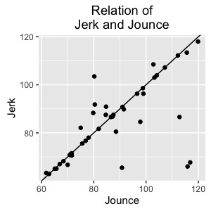
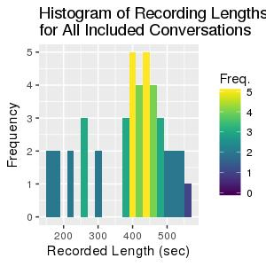
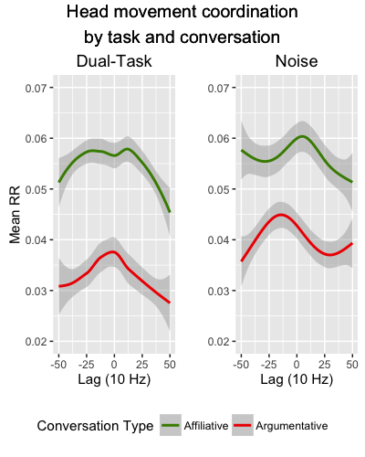

# High- and Low-Level Constraints on Coordination during Conversation: Data Analysis for Paxton & Dale (in preparation)

This R markdown provides the basis for our manuscript, "Interpersonal movement coordination responds to high- and low-level conversational constraints" (Paxton & Dale, in preparation). The study explorse how high-level (i.e., conversational context) and low-level (i.e., visual stimuli) constraints affect interpersonal coordination during conversation. We quantify coordination using amplitude of movement from head-mounted accelerometers (using Google Glass; see Paxton, Rodriguez, & Dale, 2015, *Behavior Research Methods*).

To run these analyses from scratch, you will need the following files:

-   `./data/prepped_data-DCC.csv`: Contains experimental data.
-   `./supplementary-code/libraries_and_functions-DCC.r`: Loads in necessary libraries and creates new functions for our analyses.
-   `./supplementary-code/continuous_rqa_parameters-DCC.r`: Identifies the appropriate parameters for continuous cross-recurrence quantification analysis (CRQA).

Additional files will be created during the initial run that will help reduce processing time.

**Written by**: A. Paxton (University of California, Berkeley) and R. Dale (University of California, Merced) <br>**Date last modified**: 3 October 2016

------------------------------------------------------------------------

Data trimming
=============

**NOTE**: The chunks of code in this section do not have to be run each time, since the resulting datasets will be saved to CSV files. As a result, these chunks are currently set to `eval=FALSE`. Bear this in mind if these data need to be re-calculated.

------------------------------------------------------------------------

Preliminaries
-------------

This section reads in participant data, saved in long format (i.e., one line per sample). The columns include:

-   `dyad`: identifier for each dyad
-   `partic`: identifier for each participant within each dyad
-   `conv.type`: high-level constraint (within subjects)
    -   `0` = affiliative conversation
    -   `1` = argumentative conversation
-   `cond`: low-level constraint (between subjects)
    -   `0` = noise
    -   `1` = dual-task
-   `conv.num`: conversation number (2 total for each dyad)
-   `t`: time of sample in seconds
-   `x`, `y`, `z`: accelerometer readings (from head-mounted sensor in Google Glass) at each sample in 3-dimensional plane, relative to head location at initialization

``` r
# clear our workspace
rm(list=ls())

# read in libraries and create functions
source('./supplementary-code/libraries_and_functions-DCC.r')

# read in unified dataframe
coords = read.table('./data/prepped_data-DCC.csv',sep=',',header = TRUE)
```

------------------------------------------------------------------------

Time-align movement data
------------------------

Because participants' movement series were sampled separately, we here time-align time series for each dyad.

``` r
# downsample to 10 Hz and take mean of each axis at new time scale
coords = coords %>% ungroup() %>%
  mutate(t = round(t, 1)) %>%
  group_by(dyad, partic, conv.num, conv.type, cond, t) %>%
  summarize_each(funs(mean(.)))

# isolate participants' time series within each dyad
p0 = coords %>% ungroup() %>% dplyr::filter(partic == 0) %>% select(-partic)
p0 = plyr::rename(p0, c("x" = "x0", "y" = "y0", "z" = "z0"))
p1 = coords %>% ungroup() %>% dplyr::filter(partic == 1) %>% select(-partic)
p1 = plyr::rename(p1, c("x" = "x1", "y" = "y1", "z" = "z1"))

# join together the participants' time series, leaving only any overlapping slices
coords = plyr::join(p0, p1, by=c("dyad", "conv.num", "conv.type", "cond", "t"), type="inner")
```

------------------------------------------------------------------------

Trim instructions from time series
----------------------------------

After instructions were given, both participants were instructed to shake their heads repeatedly to indicate the start of the experiment. Here, we identify that head shake by looking for the first bouts of high-velocity movement and trim everything before it.

------------------------------------------------------------------------

### Calculate Euclidean acceleration and first derivative

These data were collected using an accelerometer. Because this measures the change in velocity on each plane, we might call this Euclidean *acceleration* (rather than Euclidean distance).

Because participants were instructed to shake their heads to signal the start of the trial, we can identify that by looking at the derivatives of acceleration: jerk (first derivative of acceleration) and jounce (second derivative of acceleration). We calculate each here.

``` r
# get Euclidean acceleration and derivatives
coords.deriv = coords %>% ungroup() %>%
  group_by(dyad, conv.num, conv.type, cond) %>%
  mutate(euclid0 = c(0,euclidean(x0,y0,z0))) %>% # Euclidean acceleration for p0
  mutate(euclid1 = c(0,euclidean(x1,y1,z1))) %>% # Euclidean acceleration for p1
  mutate(jerk0 = c(0,diff(euclid0) / diff(t))) %>% # jerk for p0
  mutate(jerk1 = c(0,diff(euclid1) / diff(t))) %>% # jerk for p1
  mutate(jounce0 = c(0,diff(jerk0) / diff(t))) %>% # jounce for p0
  mutate(jounce1 = c(0,diff(jerk1) / diff(t)))  # jounce for p0
```

------------------------------------------------------------------------

### Identify cutoff points for movement

Allowing time for participant questions and any setup issues, the total instruction time preceding each conversation should have been approximately 60 to 120 seconds. We therefore check between 60 and 120 seconds of the data to identify likely beginning times using peak jerk and jounce.

``` r
# identify our minimum and maximum possible instruction end times
min.check = 60
max.check = 120

# identify possible cutoff times using jerk
cutoff.points.jerk = coords.deriv %>% ungroup() %>%
  group_by(dyad,conv.num, conv.type, cond) %>%
  dplyr::filter((t > min.check) & (t < max.check)) %>%
  select(dyad, conv.num, conv.type, cond, t, jerk0, jerk1) %>%
  summarize(cutoff = max(c(jerk0,jerk1))) %>%
  merge(.,coords.deriv) %>%
  dplyr::filter((jerk0 == cutoff) | (jerk1 == cutoff)) %>%
  select(-ends_with("0"),-ends_with("1")) 

# identify possible cutoff times using jounce
cutoff.points.jounce = coords.deriv %>% ungroup() %>%
  group_by(dyad,conv.num, conv.type, cond) %>%
  dplyr::filter((t > min.check) & (t < max.check)) %>%
  select(dyad, conv.num, conv.type, cond, t, jounce0, jounce1) %>%
  summarize(cutoff = max(c(jounce0,jounce1))) %>%
  merge(.,coords.deriv) %>%
  dplyr::filter((jounce0 == cutoff) | (jounce1 == cutoff)) %>%
  select(-ends_with("0"),-ends_with("1")) 

# are they correlated?
pander(cor.test(cutoff.points.jounce$t,cutoff.points.jerk$t),
       style = "rmarkdown")
```



Jerk and jounce are significantly correlated (r = .68, *t*(40) = 5.79, *p* &lt; .0001), and given its slightly more conservative measure (i.e., tending to identify later points), we will use the cutoff points identified by jounce. We now need to remove everything before that cutoff point from the analyzed dataset.

``` r
# rename jounce's time variable
cutoff.points.jounce = plyr::rename(cutoff.points.jounce,c("t" = 'cutoff.t'))

# merge with the rest of the dataframe and trim instruction period
coords.trimmed = coords.deriv %>% ungroup() %>%
  merge(.,cutoff.points.jounce, by = c('dyad','conv.num','conv.type','cond')) %>%
  group_by(dyad, conv.num,conv.type,cond) %>%
  dplyr::filter(t > unique(cutoff.t)) %>%
  select(-one_of("cutoff.t",'cutoff'))
```

------------------------------------------------------------------------

Run a Butterworth filter over the data
--------------------------------------

Now that we've identified our cutoff points at the beginning of each conversation, let's run a Butterworth filter over the data to smooth it a bit.

Note that the `dplyr` code is somewhat inelegant, given problems using `mutate_each` with any namespaced function (like `signal::filter`).

``` r
# set Butterworth filter values
bfilt = butter(2,.02)

# filter each dyad's time series (using workaround for "mutate_each" and namespaced function)
coords.filtered = coords.trimmed %>%
  group_by(dyad, conv.num,conv.type,cond) %>%
  mutate(euclid0 = signal::filter(bfilt, euclid0)) %>%
  mutate(euclid1 = signal::filter(bfilt, euclid1)) %>%
  mutate(jounce0 = signal::filter(bfilt, jounce0)) %>%
  mutate(jounce1 = signal::filter(bfilt, jounce1)) %>%
  select(-matches("jerk"),-matches("x"), -matches("y"), -matches("z"))
```

------------------------------------------------------------------------

Save trimmed data to file
-------------------------

``` r
write.table(coords.filtered,'./data/DCC-filtered-data.csv', sep=',',
            row.names=FALSE,col.names=TRUE)
```

------------------------------------------------------------------------

Summary statistics on conversation lengths
------------------------------------------

``` r
# read in the conversation data 
coords.filtered = read.table('./data/DCC-filtered-data.csv', sep=',',header=TRUE)

# identify the maximum time for each dyad
interaction.time = coords.filtered %>%
  select(dyad, conv.type, t) %>%
  group_by(dyad, conv.type) %>%
  summarize(duration = max(t) - min(t))

# what's the mean length of conversation data (in seconds)?
mean(interaction.time$duration)
```

    ## [1] 394.0071

``` r
# what's the range of conversation data (in seconds)?
range(interaction.time$duration)
```

    ## [1] 167.6 544.6



------------------------------------------------------------------------

Recurrence analyses
===================

**NOTE**: The chunks of code in this section do not have to be run each time, since the resulting datasets will be saved to CSV files. As a result, these chunks are currently set to `eval=FALSE`. Bear this in mind if these data need to be re-calculated.

------------------------------------------------------------------------

Preliminaries
-------------

This section clears the workspace and reads in the prepared data files.

``` r
# clear our workspace
rm(list=ls())

# read in libraries and create functions
source('./supplementary-code/libraries_and_functions-DCC.r')

# load data
coords = read.table('./data/DCC-filtered-data.csv', sep=',', header = TRUE)
```

------------------------------------------------------------------------

Identify CRQA parameters
------------------------

Before we can analyze the data, we need to identify the appropriate parameters for continuous CRQA for the dataset. We identify parameters that provide a steady *rate of recurrence* or *RR* of 5% for each conversation of each dyad and save these parameters to a CSV file.

``` r
# run CRQA parameters
source('./supplementary-code/continuous_rqa_parameters-DCC.r')
```

------------------------------------------------------------------------

Prepare for CRQA and DRPs
-------------------------

``` r
# read in our chosen parameters
crqa_params = read.table('./data/crqa_data_and_parameters-DCC.csv', 
                         sep=',',header=TRUE)

# grab only the parameters we need
crqa_params = crqa_params %>%
  select(-matches('euclid')) %>%
  distinct()

# rescale the data (by mean)
coords_crqa = coords %>% ungroup() %>%
  group_by(dyad,conv.num) %>%
  mutate(rescale.euclid0 = euclid0/mean(euclid0)) %>%
  mutate(rescale.euclid1 = euclid1/mean(euclid1)) %>%
  select(-matches('jounce'))

# fold in our CRQA parameter information
coords_crqa = plyr::join(x=crqa_params,y=coords_crqa,
                         by=c('dyad'='dyad',
                              'conv.num'='conv.num'))

# slice up the data so that we have one dataset per conversation
split_convs = split(coords_crqa, 
                    list(coords_crqa$dyad, coords_crqa$conv.num))
```

------------------------------------------------------------------------

Run CRQA and DRPs
-----------------

Now that we have our parameters, we run continuous CRQA over each conversation for each dyad using the `crqa` function from the `crqa` package (Coco & Dale, 2014, *Frontiers in Psychology*). In addition to saving the standard plot-level metrics, we also save individual cross-recurrence plots to file.

**Note**: Saving the cross-recurrence plots is not necessary for later steps of the analysis and adds significant computational strain. The section producing the plots may be commented out to save time, if desired.

``` r
# identify window size
target_seconds = 5
sampling_rate = 10
win_size = target_seconds * sampling_rate

# cycle through each conversation using the sliced subsets
drp_results = data.frame()
crqa_results = data.frame()
for (next_conv in split_convs){

  # isolate parameters for this next dyad
  chosen.delay = unique(next_conv$chosen.delay)
  chosen.embed = unique(next_conv$chosen.embed)
  chosen.radius = unique(next_conv$chosen.radius)

  # run cross-recurrence
  rec_analysis = crqa(ts1=next_conv$rescale.euclid0,
                      ts2=next_conv$rescale.euclid1,
                      delay=chosen.delay,
                      embed=chosen.embed,
                      r=chosen.radius,
                      normalize=0, rescale=0, mindiagline=2,
                      minvertline=2, tw=0, whiteline=FALSE,
                      recpt=FALSE)

  # grab useful information for plot
  dyad_num = unique(next_conv$dyad)
  if (unique(next_conv$conv.type)==0){ conv_type = 'Affiliative'
  } else { conv_type = 'Argumentative' }

  # create and save recurrence plot
  plot_title = paste('Cross-Recurrence Plot\n for Dyad ',dyad_num,
                     ', ',conv_type,' Conversation',sep="")
  rec_plot = qplot(rec_analysis$RP@i,seq_along(rec_analysis$RP@i),
                   size=I(0.5), main=plot_title) +
    theme(legend.position="none",axis.text.x = element_blank(),
          axis.text.y = element_blank()) +
    ylab("") + xlab("")
  ggsave(filename=paste('./figures/recurrence_plots/plot_',
                        dyad_num,'_',conv_type,'.pdf',sep=""),
         plot=rec_plot,width=6, height=6)

  # save plot-level information to dataframe
  next_data_line = data.frame(c(dyad_num,
                                unique(next_conv$conv.type),
                                rec_analysis[1:9]))
  names(next_data_line) = c("dyad",'conv.type',names(rec_analysis[1:9]))
  crqa_results = rbind.data.frame(crqa_results,next_data_line)
  
  # recreate DRP from diagonal lines within our target window
  diag_lines = spdiags(rec_analysis$RP)
  subset_plot = data.frame(diag_lines$B[,diag_lines$d >= -win_size & diag_lines$d <= win_size])
  rr = colSums(subset_plot)/dim(subset_plot)[1]
  
  # convert to dataframe, padding (with 0) where no RR was observed (since `spdiags` returns only nonzero vectors)
  next_drp = full_join(data.frame(lag = as.integer(str_replace(names(rr),'X',''))-51,
                                  rr = rr),
                       data.frame(lag = -win_size:win_size), 
                       by='lag')
  next_drp[is.na(next_drp)] = 0
  
  # save it to dataframe
  next_drp$dyad = dyad_num
  next_drp$conv.type = unique(next_conv$conv.type)
  drp_results = rbind.data.frame(drp_results,next_drp)
}

# save results to file
write.table(crqa_results,'./data/crqa_results-DCC.csv',sep=",")
write.table(drp_results,'./data/drp_results-DCC.csv',sep=',')
```

------------------------------------------------------------------------

Export merged recurrence dataset
--------------------------------

``` r
# merge CRQA and DRP analysis results
recurrence_results = plyr::join(drp_results, crqa_results,
                                by=c('dyad','conv.type'))

# grab information about experiment condition
additional_dyad_info = coords %>% ungroup() %>%
  select(dyad,conv.num,conv.type,cond) %>% distinct()

# merge recurrence analyses and condition information
recurrence_df = plyr::join(recurrence_results, additional_dyad_info,
           by=c('dyad','conv.type'))

# save to file
write.table(recurrence_df,'./data/recurrence_df-DCC.csv',sep=',')
```

------------------------------------------------------------------------

Data preparation
================

Now that we've calculated our CRQA and DRP measures, we're ready to prepare our data for analysis.

**NOTE**: The chunks of code in this section do not have to be run each time, since the resulting datasets will be saved to CSV files. As a result, these chunks are currently set to `eval=FALSE`. Bear this in mind if these data need to be re-calculated.

------------------------------------------------------------------------

Preliminaries
-------------

This section clears the workspace and reads in the prepared data files.

``` r
# clear our workspace
rm(list=ls())

# read in libraries and create functions
source('./supplementary-code/libraries_and_functions-DCC.r')

# read in the recurrence dataframe
recurrence_df = read.table('./data/recurrence_df-DCC.csv',sep=',',header=TRUE)
```

------------------------------------------------------------------------

Create first- and second-order polynomials
------------------------------------------

In order to examine the linear and curvilinear patterns in the DRPs (cf. Main, Paxton, & Dale, 2016, *Emotion*), we create orthogonal polynomials for the lag term. This section creates the first- and second-order othogonal polynomials that are essential to allowing us to interpret the linear (i.e., first-order polynomial) and quadratic (i.e., second-order polynomial) patterns in the DRP independently from one another.

``` r
# create first- and second-order orthogonal polynomials for lag
raw_lag = min(recurrence_df$lag):max(recurrence_df$lag)
lag_vals = data.frame(raw_lag)
lag_offset = (0-min(raw_lag)) + 1
t = stats::poly((raw_lag + lag_offset), 2)
lag_vals[, paste("ot", 1:2, sep="")] = t[lag_vals$raw_lag + lag_offset, 1:2]

# join it to the original data table
recurrence_df = left_join(recurrence_df,lag_vals, by = c("lag" = "raw_lag"))
```

------------------------------------------------------------------------

Create interaction terms
------------------------

Because we will be providing both standardized and raw models, we create all interaction terms here. For simplicity, we will now change the `conv.type` variable to `convers` and `cond` to `condition`. Additionally, because we will be manually creating all interaction terms, we code `condition` and `convers` with levels `-0.5` and `0.5`; this ensures that we have nonzero values for interaction terms in the affiliative (`convers = 0`) and dual-task (`condition = 0`) cases.

``` r
# rename variables and center the binary variables
recurrence_df = recurrence_df %>% ungroup() %>%
  plyr::rename(.,
               c("conv.type"="convers",
                 "cond"="condition")) %>%
  mutate(condition = condition-.5) %>%
  mutate(convers = convers-.5) %>%
  mutate(condition.convers = condition * convers) %>%
  
  # first-order polynomials
  mutate(condition.ot1 = condition * ot1) %>%
  mutate(convers.ot1 = convers * ot1) %>%
  mutate(condition.convers.ot1 = condition * convers * ot1) %>%
  
  # second-order polynomials
  mutate(condition.ot2 = condition * ot2) %>%
  mutate(convers.ot2 = convers * ot2) %>%
  mutate(condition.convers.ot2 = condition * convers * ot2) %>%
  
  # polynomial interactions
  mutate(ot1.ot2 = ot1 * ot2) %>%
  mutate(condition.ot1.ot2 = condition * ot1 * ot2) %>%
  mutate(convers.ot1.ot2 = convers * ot1 * ot2) %>%
  mutate(condition.convers.ot1.ot2 = condition * convers * ot1 * ot2)
```

------------------------------------------------------------------------

Create standardized dataframe
-----------------------------

Let's create a new dataframe with all standardized variables. This allows us to interpret the resulting values as effect sizes (see Keith, 2005, *Multiple regression and beyond*).

``` r
# standardize all variables
rec_st = mutate_each(recurrence_df,funs(as.numeric(scale(.))))
```

------------------------------------------------------------------------

Export analysis and plotting dataframes
---------------------------------------

``` r
# export plotting dataframe
write.table(recurrence_df,'./data/plotting_df-DCC.csv',row.names=FALSE,sep=',')

# export standardized analysis dataframe
write.table(rec_st,'./data/analysis_df-DCC.csv',row.names=FALSE,sep=',')
```

------------------------------------------------------------------------

Data analysis
=============

All data have been cleaned, all parameters have been identified, and all final data preparation has been finished. Using the analysis-ready dataframe (`rec_st`) and plotting dataframe (`rec_plot`), we now analyze our data and generate visualizations.

------------------------------------------------------------------------

Preliminaries
-------------

This section clears the workspace and reads in the prepared data files.

``` r
# clear our workspace
rm(list=ls())

# read in libraries and create functions
source('./supplementary-code/libraries_and_functions-DCC.r')

# read in the plotting and analysis recurrence dataframes
rec_st = read.table('./data/analysis_df-DCC.csv',sep=',',header=TRUE)
rec_plot = read.table('./data/plotting_df-DCC.csv',sep=',',header=TRUE)
```

------------------------------------------------------------------------

Recurrence by lag, conversation type, and condition
---------------------------------------------------

We now create a linear mixed-effects model to gauge how linear lag (`ot1`) and quadratic lag (`ot2`) interact with conversation type (`convers`) and task (`condition`) to influence head movement coordination (`rr`). We present both standardized and raw models below.

``` r
# standardized model
rec_convers_condition_gca_st = lmer(rr ~ convers + condition + ot1 + ot2 +
                                      condition.convers + ot1.ot2 +
                                      convers.ot1 + condition.ot1 + condition.convers.ot1 +
                                      convers.ot2 + condition.ot2 + condition.convers.ot2 +
                                      convers.ot1 + condition.ot1 + condition.convers.ot1 +
                                      convers.ot1.ot2 + condition.ot1.ot2 + condition.convers.ot1.ot2 +
                                      (1 + ot1 + ot2 + convers + condition.convers.ot1 | conv.num) + 
                                      (1 + ot1 + ot2 + convers + condition.convers.ot1 | dyad), 
                                    data=rec_st,REML=FALSE)
invisible(pander_lme_to_latex(rec_convers_condition_gca_st,'standardized_model_latex-DCC.tex'))
pander_lme(rec_convers_condition_gca_st,stats.caption = TRUE)
```

|                               |  Estimate | Std..Error |  t.value |   p   |   sig  |
|:-----------------------------:|:---------:|:----------:|:--------:|:-----:|:------:|
|        **(Intercept)**        | -0.003143 |   0.1826   | -0.01721 |  0.99 |        |
|          **convers**          |  -0.4006  |   0.09032  |  -4.435  |   0   | \*\*\* |
|         **condition**         |  0.08417  |   0.1398   |  0.6022  |  0.55 |        |
|            **ot1**            |  -0.05408 |   0.04828  |   -1.12  |  0.26 |        |
|            **ot2**            |  -0.08307 |   0.05609  |  -1.481  | 0.139 |        |
|     **condition.convers**     |  0.04365  |   0.08955  |  0.4875  |  0.63 |        |
|          **ot1.ot2**          |  0.01577  |  0.007959  |   1.981  | 0.048 |   \*   |
|        **convers.ot1**        |  -0.02264 |   0.04189  |  -0.5406 |  0.59 |        |
|       **condition.ot1**       |  -0.01609 |   0.04756  |  -0.3384 |  0.74 |        |
|   **condition.convers.ot1**   |  -0.04469 |   0.04213  |  -1.061  |  0.29 |        |
|        **convers.ot2**        |  0.01052  |  0.005704  |   1.844  | 0.065 |    .   |
|       **condition.ot2**       |   0.0159  |   0.04667  |  0.3406  |  0.73 |        |
|   **condition.convers.ot2**   |  0.001052 |  0.005608  |  0.1876  |  0.85 |        |
|      **convers.ot1.ot2**      |   0.0447  |  0.007959  |   5.617  |   0   | \*\*\* |
|     **condition.ot1.ot2**     |  0.02458  |  0.007959  |   3.088  | 0.002 |  \*\*  |
| **condition.convers.ot1.ot2** |  0.05188  |  0.007959  |   6.518  |   0   | \*\*\* |

``` r
# raw model
rec_convers_condition_gca_raw = lmer(rr ~ convers + condition + ot1 + ot2 +
                                      condition.convers + ot1.ot2 +
                                      convers.ot1 + condition.ot1 + condition.convers.ot1 +
                                      convers.ot2 + condition.ot2 + condition.convers.ot2 +
                                      convers.ot1 + condition.ot1 + condition.convers.ot1 +
                                      convers.ot1.ot2 + condition.ot1.ot2 + condition.convers.ot1.ot2 +
                                      (1 + ot1 + ot2 + convers + condition.convers.ot1 | conv.num) + 
                                      (1 + ot1 + ot2 + convers + condition.convers.ot1 | dyad), 
                                     data=rec_plot,REML=FALSE)
pander_lme(rec_convers_condition_gca_raw,stats.caption = TRUE)
```

|                               |  Estimate | Std..Error | t.value |   p   |   sig  |
|:-----------------------------:|:---------:|:----------:|:-------:|:-----:|:------:|
|        **(Intercept)**        |  0.04603  |  0.004751  |  9.688  |   0   | \*\*\* |
|          **convers**          |  -0.02072 |  0.004671  |  -4.435 |   0   | \*\*\* |
|         **condition**         |  0.004398 |  0.007302  |  0.6022 |  0.55 |        |
|            **ot1**            |  -0.01405 |   0.01255  |  -1.12  |  0.26 |        |
|            **ot2**            |  -0.02159 |   0.01457  |  -1.481 | 0.139 |        |
|     **condition.convers**     |  0.004515 |  0.009262  |  0.4875 |  0.63 |        |
|          **ot1.ot2**          |  0.03286  |   0.01658  |  1.981  | 0.048 |   \*   |
|        **convers.ot1**        |  -0.01177 |   0.02177  | -0.5406 |  0.59 |        |
|       **condition.ot1**       | -0.008363 |   0.02472  | -0.3384 |  0.74 |        |
|   **condition.convers.ot1**   |  -0.04645 |   0.04379  |  -1.061 |  0.29 |        |
|        **convers.ot2**        |  0.005466 |  0.002964  |  1.844  | 0.065 |    .   |
|       **condition.ot2**       |  0.008261 |   0.02426  |  0.3406 |  0.73 |        |
|   **condition.convers.ot2**   |  0.001094 |  0.005829  |  0.1876 |  0.85 |        |
|      **convers.ot1.ot2**      |   0.1863  |   0.03317  |  5.617  |   0   | \*\*\* |
|     **condition.ot1.ot2**     |   0.1024  |   0.03317  |  3.088  | 0.002 |  \*\*  |
| **condition.convers.ot1.ot2** |   0.4324  |   0.06634  |  6.518  |   0   | \*\*\* |

The model's results indeed suggest that high- and low-level constraints influence coordination dynamics. We again saw that participants tend to be coordinated overall, although with a slight leading/following pattern (`ot.ot2`). Extending previous findings with gross body movements in another naturalistic interaction corpus (Paxton & Dale, 2013, *Quarterly Journal of Experimental Psychology*), we here found that argument decreases interpersonal synchrony (`convers`). Conversation type also influenced the dynamics of coordination: Recurrence during the affiliative conversations was higher but more diffuse, while recurrence in the argumentative conversation was lower but more peaked (`convers.ot1.ot2`; trend for `convers.ot2`).

Interestingly, although we hypothesized that the noise condition would increase coordination compared to a dual-task condition, we did not find a simple effect of condition (`condition`). Instead, condition affected the dynamics of coordination. Participants in the dual-task condition appeared to show a more iconic quadratic pattern (more greater temporal coupling) than those in the noise condition (`condition.ot1.ot2`).

We also found a complex, four-way interaction among predictors (`condition.convers.ot1.ot2`). Briefly, it appears that some of the major differences are being carried by (1) the difference between the argumentative conversation in the dual-task versus noise condition and (2) the relatively diffuse coordination of the affiliative conversation in the dual-task condition.

Taken together, we view our results as consistent with the growing view of interpersonal communication as a complex dynamical system.



------------------------------------------------------------------------
