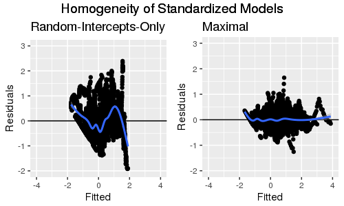
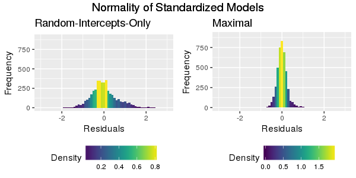
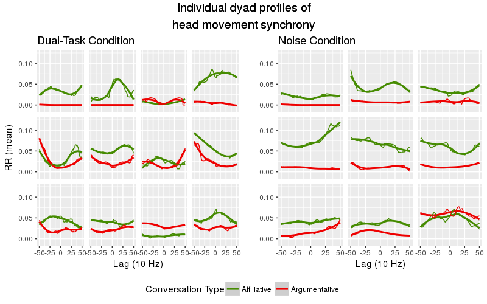

# High- and Low-Level Constraints on Coordination during Conversation: Code for Paxton & Dale (under review)

This R markdown provides the basis for our manuscript, "Interpersonal movement synchrony responds to high- and low-level conversational constraints" (Paxton & Dale, under review). The study explores how high-level (i.e., conversational context) and low-level (i.e., visual stimuli) constraints affect interpersonal synchrony during conversation. We quantify coordination using amplitude of movement from head-mounted accelerometers (using Google Glass; see Paxton, Rodriguez, & Dale, 2015, *Behavior Research Methods*).

To run these analyses from scratch, you will need the following files:

* `./data/prepped_data-DCC.csv`: Contains experimental data. All data for included dyads are freely available in the OSF repository for the project: `https://osf.io/x9ay6/`.
* `./supplementary-code/required_packages-DCC.r`: Installs required libraries, if they are not already installed. (This should be run *before* running this Rmarkdown file.)
* `./supplementary-code/libraries_and_functions-DCC.r`: Loads in necessary libraries and creates new functions for our analyses.
* `./supplementary-code/continuous_rqa_parameters-DCC.r`: Identifies the appropriate parameters for continuous cross-recurrence quantification analysis (CRQA).

Additional files will be created during the initial run that will help reduce processing time. Several of these files--including the chosen CRQA parameters, the final plotting dataframe, and the final analysis dataframe---are available as CSVs from the OSF repository listed above.

**Written by**: A. Paxton (University of California, Berkeley) and R. Dale (University of California, Merced)
<br>**Date last modified**: 22 May 2017

***

# Data trimming

**NOTE**: The chunks of code in this section do not have to be run each time, since the resulting datasets will be saved to CSV files. As a result, these chunks are currently set to `eval=FALSE`. Bear this in mind if these data need to be re-calculated.

***

## Preliminaries

This section reads in participant data, saved in long format (i.e., one line per sample). The columns include:

* `dyad`: identifier for each dyad
* `partic`: identifier for each participant within each dyad
* `conv.type`: high-level constraint (within subjects)
    + `0` = affiliative conversation
    + `1` = argumentative conversation
* `cond`: low-level constraint (between subjects)
    + `0` = noise
    + `1` = dual-task
* `conv.num`: conversation number (2 total for each dyad)
* `t`: time of sample in seconds
* `x`, `y`, `z`: accelerometer readings (from head-mounted sensor in Google Glass) at each sample in 3-dimensional plane, relative to head location at initialization


```r
# clear our workspace
rm(list=ls())

# read in libraries and create functions
source('./supplementary-code/libraries_and_functions-DCC.r')

# read in unified dataframe
coords = read.table('./data/prepped_data-DCC.csv',sep=',',header = TRUE)
```

***

## Pre-process movement data

Because participants' movement series were sampled separately, we here time-align time series for each dyad.

These data were collected using an accelerometer. Because this measures the change in velocity on each plane, we might call this Euclidean *acceleration* (rather than Euclidean distance).


```r
# specify Butterworth filters
anti_aliasing_butter = butter(4,.4)
post_downsample_butter = butter(2,.02)

# get Euclidean acceleration, filter, downsample, and take mean of each axis at new time scale
coords = coords %>% ungroup() %>%
  group_by(dyad,partic,conv.num,conv.type,cond) %>%
  mutate(euclid_accel = c(NA,euclidean(x,y,z))) %>% # get Euclidean acceleration
  mutate(euclid_accel = signal::filtfilt(anti_aliasing_butter, euclid_accel)) %>% # filter
  select(-x,-y,-z) %>% # drox unneeded variables
  mutate(t = floor(t * sampling_rate) / sampling_rate) %>% # downsample
  ungroup() %>%
  group_by(dyad, partic, conv.num, conv.type, cond, t) %>%
  summarize_each(funs(mean(.))) %>% # take means
  mutate(euclid_accel = signal::filtfilt(post_downsample_butter, euclid_accel)) # filter

# isolate participants' time series within each dyad
p0 = coords %>% ungroup() %>% 
  dplyr::filter(partic == 0) %>% 
  select(-partic) %>%
  dplyr::rename(euclid0 = euclid_accel)
p1 = coords %>% ungroup() %>% 
  dplyr::filter(partic == 1) %>% 
  select(-partic) %>%
  dplyr::rename(euclid1 = euclid_accel)

# join together the participants' time series, leaving only any overlapping slices
coords = plyr::join(p0, p1, 
                    by=c("dyad", "conv.num", "conv.type", "cond", "t"), 
                    type="inner")
```

***

## Trim instructions from time series

After instructions were given, both participants were instructed to shake their heads repeatedly to indicate the start of the experiment.  Here, we identify that head shake by looking for the first bouts of high-velocity movement and trim everything before it.

***

### Calculate Euclidean acceleration first and derivatives

Because participants were instructed to shake their heads to signal the start of the trial, we can identify that by looking at the derivatives of acceleration: jerk (first derivative of acceleration) and jounce (second derivative of acceleration). We calculate each here.


```r
# get acceleration derivatives
coords.deriv = coords %>% ungroup() %>%
  group_by(dyad, conv.num, conv.type, cond) %>%
  mutate(jerk0 = c(0,diff(euclid0) / diff(t))) %>% # jerk for p0
  mutate(jerk1 = c(0,diff(euclid1) / diff(t))) %>% # jerk for p1
  mutate(jounce0 = c(0,diff(jerk0) / diff(t))) %>% # jounce for p0
  mutate(jounce1 = c(0,diff(jerk1) / diff(t))) # jounce for p1
```

***

### Identify cutoff points for movement

Allowing time for participant questions and any setup issues, the total instruction time preceding each conversation should have been approximately 60 to 120 seconds. We therefore check between 60 and 120 seconds of the data to identify likely beginning times using peak jerk and jounce.


```r
# identify our minimum and maximum possible instruction end times
min.check = 60
max.check = 120

# identify possible cutoff times using jerk
cutoff.points.jerk = coords.deriv %>% ungroup() %>%
  group_by(dyad,conv.num, conv.type, cond) %>%
  dplyr::filter((t > min.check) & (t < max.check)) %>%
  select(dyad, conv.num, conv.type, cond, t, jerk0, jerk1) %>%
  dplyr::summarize(cutoff = max(c(jerk0,jerk1))) %>%
  merge(.,coords.deriv) %>%
  dplyr::filter((jerk0 == cutoff) | (jerk1 == cutoff)) %>%
  select(-ends_with("0"),-ends_with("1"))

# identify possible cutoff times using jounce
cutoff.points.jounce = coords.deriv %>% ungroup() %>%
  group_by(dyad,conv.num, conv.type, cond) %>%
  dplyr::filter((t > min.check) & (t < max.check)) %>%
  select(dyad, conv.num, conv.type, cond, t, jounce0, jounce1) %>%
  dplyr::summarize(cutoff = max(c(jounce0,jounce1))) %>%
  merge(.,coords.deriv) %>%
  dplyr::filter((jounce0 == cutoff) | (jounce1 == cutoff)) %>%
  select(-ends_with("0"),-ends_with("1"))
```


```r
# are they correlated?
pander::pander(cor.test(cutoff.points.jounce$t,cutoff.points.jerk$t),
       style = "rmarkdown")
```


|  Test statistic  |  df  |     P value      |  Alternative hypothesis  |
|:----------------:|:----:|:----------------:|:------------------------:|
|      4.936       |  40  | 1.451e-05  * * * |        two.sided         |

Table: Pearson's product-moment correlation: `cutoff.points.jounce$t` and `cutoff.points.jerk$t`


Jerk and jounce are significantly correlated, so we'll use the more conservative measure (i.e., tending to identify later points). We then remove everything before that cutoff point from the analyzed dataset.


```r
# identify which tends to be more conservative
cutoff_test = cutoff.points.jerk$t - cutoff.points.jounce$t
conservative_jerk = length(cutoff_test[cutoff_test>=0])
conservative_jounce = length(cutoff_test[cutoff_test<0])
if( conservative_jerk >= conservative_jounce ){
  cutoff.points = plyr::rename(cutoff.points.jerk,c('t'='cutoff.t'))
}else{
  cutoff.points = plyr::rename(cutoff.points.jounce,c('t'='cutoff.t'))
}

# merge with the rest of the dataframe, trim instruction period, drop unneded variables, and filter
coords.trimmed = coords.deriv %>% ungroup() %>%
  merge(., cutoff.points, 
        by = c('dyad','conv.num','conv.type','cond')) %>%
  group_by(dyad, conv.num, conv.type, cond) %>%
  dplyr::filter(t > unique(cutoff.t)) %>%
  select(-one_of('cutoff.t','cutoff'), 
         -matches('jerk'), 
         -matches('jounce'))
```

***

## Save trimmed data to file


```r
write.table(coords.trimmed,'./data/DCC-trimmed-data.csv', sep=',',
            row.names=FALSE,col.names=TRUE)
```

***

## Summary statistics on conversation lengths

What do the final data look like (after trimming the calibration period)?


```r
# identify the maximum time for each dyad
interaction.time = coords.trimmed %>%
  dplyr::group_by(dyad, conv.type) %>%
  dplyr::summarize(duration = max(t) - min(t))

# what's the mean length of conversation data (in seconds)?
mean(interaction.time$duration)
```

```
## [1] 392.4857
```

```r
# what's the range of conversation data (in seconds)?
range(interaction.time$duration)
```

```
## [1] 157.0 555.7
```


***

# Recurrence analyses

**NOTE**: The chunks of code in this section do not have to be run each time, since the resulting datasets will be saved to CSV files. As a result, these chunks are currently set to `eval=FALSE`. Bear this in mind if these data need to be re-calculated.

***

## Preliminaries

This section clears the workspace and reads in the prepared data files.


```r
# clear our workspace
rm(list=ls())

# read in libraries and create functions
source('./supplementary-code/libraries_and_functions-DCC.r')

# load data
coords = read.table('./data/DCC-trimmed-data.csv', sep=',', header = TRUE)
```

***

## Identify CRQA parameters

Before we can analyze the data, we need to identify the appropriate parameters for continuous CRQA for the dataset. We identify parameters that provide a steady *rate of recurrence* or *RR* of 5% for each conversation of each dyad and save these parameters to a CSV file.

The source file produces outputs that are useful for tracking progress, but we suppress them here for brevity.


***

## Prepare for CRQA and DRPs

Here we join the CRQA parameters identified above to the existing movement dataframe.


```r
# read in our chosen parameters
crqa_params = read.table('./data/crqa_data_and_parameters-DCC.csv',
                         sep=',',header=TRUE)

# grab only the parameters we need
crqa_params = crqa_params %>%
  select(-matches('euclid')) %>%
  distinct()

# rescale the data (by mean)
coords_crqa = coords %>% ungroup() %>%
  group_by(dyad,conv.num) %>%
  mutate(rescale.euclid0 = euclid0/mean(euclid0)) %>%
  mutate(rescale.euclid1 = euclid1/mean(euclid1)) %>%
  select(-matches('jounce'))

# fold in our CRQA parameter information
coords_crqa = plyr::join(x=crqa_params,y=coords_crqa,
                         by=c('dyad'='dyad',
                              'conv.num'='conv.num'))

# slice up the data so that we have one dataset per conversation
split_convs = split(coords_crqa,
                    list(coords_crqa$dyad, coords_crqa$conv.num))
```

***

## Run CRQA and DRPs

Now that we have our parameters, we run continuous CRQA over each conversation for each dyad using the `crqa` function from the `crqa` package (Coco & Dale, 2014, *Frontiers in Psychology*). This again produces output that can be useful for tracking progress, but we supress these messages for brevity.


```r
# identify window size
target_seconds = 5
win_size = target_seconds * sampling_rate

# cycle through each conversation using the sliced subsets
drp_results = data.frame()
crqa_results = data.frame()
for (next_conv in split_convs){
  
  # isolate parameters for this next dyad
  chosen.delay = unique(next_conv$chosen.delay)
  chosen.embed = unique(next_conv$chosen.embed)
  chosen.radius = unique(next_conv$chosen.radius)
  
  # # print update
  # print(paste("CRQA: Dyad ", unique(next_conv$dyad),
  #             ", conversation ",unique(next_conv$conv.num),
  #             sep=""))
  
  # run cross-recurrence
  rec_analysis = crqa(ts1=next_conv$rescale.euclid0,
                      ts2=next_conv$rescale.euclid1,
                      delay=chosen.delay,
                      embed=chosen.embed,
                      r=chosen.radius,
                      normalize=0, 
                      rescale=0, 
                      mindiagline=2,
                      minvertline=2, 
                      tw=0, 
                      whiteline=FALSE,
                      recpt=FALSE)
  
  # save plot-level information to dataframe
  dyad_num = unique(next_conv$dyad)
  next_data_line = data.frame(c(dyad_num,
                                unique(next_conv$conv.type),
                                rec_analysis[1:9]))
  names(next_data_line) = c("dyad",'conv.type',names(rec_analysis[1:9]))
  crqa_results = rbind.data.frame(crqa_results,next_data_line)

  # recreate DRP from diagonal lines within our target window
  diag_lines = spdiags(rec_analysis$RP)
  subset_plot = data.frame(diag_lines$B[,diag_lines$d >= -win_size & diag_lines$d <= win_size])
  rr = colSums(subset_plot)/dim(subset_plot)[1]

  # convert to dataframe, padding (with 0) where no RR was observed
  next_drp = dplyr::full_join(data.frame(lag = as.integer(stringr::str_replace(names(rr),'X',''))-(win_size+1),
                                  rr = rr),
                       data.frame(lag = -win_size:win_size),
                       by='lag')
  next_drp[is.na(next_drp)] = 0

  # save it to dataframe
  next_drp$dyad = dyad_num
  next_drp$conv.type = unique(next_conv$conv.type)
  drp_results = rbind.data.frame(drp_results,next_drp)
}

# save results to file
write.table(crqa_results,'./data/crqa_results-DCC.csv',sep=",")
write.table(drp_results,'./data/drp_results-DCC.csv',sep=',')
```

***

## Export merged recurrence dataset


```r
# merge CRQA and DRP analysis results
recurrence_results = plyr::join(drp_results, crqa_results,
                                by=c('dyad','conv.type'))

# grab information about experiment condition
additional_dyad_info = coords %>% ungroup() %>%
  select(dyad,conv.num,conv.type,cond) %>% distinct()

# merge recurrence analyses and condition information
recurrence_df = plyr::join(recurrence_results, additional_dyad_info,
           by=c('dyad','conv.type'))

# save to file
write.table(recurrence_df,'./data/recurrence_df-DCC.csv',sep=',')
```

***

# Data preparation

Now that we've calculated our CRQA and DRP measures, we're ready to prepare our data for analysis.

**NOTE**: The chunks of code in this section do not have to be run each time, since the resulting datasets will be saved to CSV files. As a result, these chunks are currently set to `eval=FALSE`. Bear this in mind if these data need to be re-calculated.

***

## Preliminaries

This section clears the workspace and reads in the prepared data files.


```r
# clear our workspace
rm(list=ls())

# read in libraries and create functions
source('./supplementary-code/libraries_and_functions-DCC.r')

# read in the recurrence dataframe
recurrence_df = read.table('./data/recurrence_df-DCC.csv',sep=',',header=TRUE)
```

***

## Create first- and second-order polynomials

In order to examine the linear and curvilinear patterns in the DRPs (cf. Main, Paxton, & Dale, 2016, *Emotion*), we create orthogonal polynomials for the lag term. This section creates the first- and second-order othogonal polynomials that are essential to allowing us to interpret the linear (i.e., first-order polynomial) and quadratic (i.e., second-order polynomial) patterns in the DRP independently from one another.


```r
# create first- and second-order orthogonal polynomials for lag
raw_lag = min(recurrence_df$lag):max(recurrence_df$lag)
lag_vals = data.frame(raw_lag)
lag_offset = (0-min(raw_lag)) + 1
t = stats::poly((raw_lag + lag_offset), 2)
lag_vals[, paste("ot", 1:2, sep="")] = t[lag_vals$raw_lag + lag_offset, 1:2]

# join it to the original data table
recurrence_df = left_join(recurrence_df,lag_vals, by = c("lag" = "raw_lag"))
```


***

## Create interaction terms

Because we will be providing both standardized and raw models, we create all interaction terms here. For simplicity, we will now change the `conv.type` variable to `convers` and `cond` to `condition`. Additionally, because we will be manually creating all interaction terms, we code `condition` and `convers` with levels `-0.5` and `0.5`; this ensures that we have nonzero values for interaction terms in the affiliative (`convers = 0`) and dual-task (`condition = 0`) cases.


```r
# rename variables and center the binary variables
recurrence_df = recurrence_df %>% ungroup() %>%
  plyr::rename(.,
               c("conv.type"="convers",
                 "cond"="condition")) %>%
  mutate(condition = condition-.5) %>%
  mutate(convers = convers-.5) %>%
  mutate(condition.convers = condition * convers) %>%

  # first-order polynomials
  mutate(condition.ot1 = condition * ot1) %>%
  mutate(convers.ot1 = convers * ot1) %>%
  mutate(condition.convers.ot1 = condition * convers * ot1) %>%

  # second-order polynomials
  mutate(condition.ot2 = condition * ot2) %>%
  mutate(convers.ot2 = convers * ot2) %>%
  mutate(condition.convers.ot2 = condition * convers * ot2) %>%

  # polynomial interactions
  mutate(ot1.ot2 = ot1 * ot2) %>%
  mutate(condition.ot1.ot2 = condition * ot1 * ot2) %>%
  mutate(convers.ot1.ot2 = convers * ot1 * ot2) %>%
  mutate(condition.convers.ot1.ot2 = condition * convers * ot1 * ot2)
```

***

## Create standardized dataframe

Let's create a new dataframe with all standardized variables. This allows us to interpret the resulting values as effect sizes (see Keith, 2005, *Multiple regression and beyond*).


```r
# standardize all variables
rec_st = mutate_each(recurrence_df,funs(as.numeric(scale(.))))
```

***

## Export analysis and plotting dataframes


```r
# export plotting dataframe
write.table(recurrence_df,'./data/plotting_df-DCC.csv',row.names=FALSE,sep=',')

# export standardized analysis dataframe
write.table(rec_st,'./data/analysis_df-DCC.csv',row.names=FALSE,sep=',')
```

***

# Data analysis

All data have been cleaned, all parameters have been identified, and all final data preparation has been finished. Using the analysis-ready dataframe (`rec_st`) and plotting dataframe (`rec_plot`), we now analyze our data and generate visualizations.

***

## Preliminaries

This section clears the workspace and reads in the prepared data files.


```r
# clear our workspace
rm(list=ls())

# read in libraries and create functions
source('./supplementary-code/libraries_and_functions-DCC.r')

# read in the plotting and analysis recurrence dataframes
rec_st = read.table('./data/analysis_df-DCC.csv',sep=',',header=TRUE)
rec_plot = read.table('./data/plotting_df-DCC.csv',sep=',',header=TRUE)
```

***

## Recurrence by lag, conversation type, and condition

We now create a linear mixed-effects model to gauge how linear lag (`ot1`) and quadratic lag (`ot2`) interact with conversation type (`convers`) and task (`condition`) to influence head movement coordination (`rr`). We present both standardized and raw models below.


```r
# standardized maximal random-effects model
rec_convers_condition_gca_st = lmer(rr ~ convers + condition + ot1 + ot2 +
                                       condition.convers + ot1.ot2 +
                                       convers.ot1 + condition.ot1 + condition.convers.ot1 +
                                       convers.ot2 + condition.ot2 + condition.convers.ot2 +
                                       convers.ot1.ot2 + condition.ot1.ot2 + condition.convers.ot1.ot2 +
                                       (1 + ot1 + ot2 + convers + condition.convers.ot1 | conv.num) + 
                                       (1 + ot1 + ot2 + convers + condition.convers.ot1 | dyad), 
                                    data=rec_st, REML=FALSE)
invisible(pander_lme_to_latex(rec_convers_condition_gca_st,'standardized_model_latex-DCC.tex'))
pander_lme(rec_convers_condition_gca_st,stats.caption = TRUE)
```


|             &nbsp;              |  Estimate  |  Std..Error  |  t.value  |   p   |  sig  |
|:-------------------------------:|:----------:|:------------:|:---------:|:-----:|:-----:|
|         **(Intercept)**         |  -0.01467  |    0.1322    |  -0.111   | 0.91  |       |
|           **convers**           |  -0.6005   |    0.1136    |  -5.288   |   0   |  ***  |
|          **condition**          |  -0.1021   |    0.1088    |  -0.9384  | 0.35  |       |
|             **ot1**             |  0.02255   |   0.05476    |  0.4118   | 0.68  |       |
|             **ot2**             |  0.05377   |   0.04481    |    1.2    | 0.23  |       |
|      **condition.convers**      |   0.1333   |    0.1035    |   1.289   | 0.197 |       |
|           **ot1.ot2**           |  -0.03899  |    0.0055    |  -7.089   |   0   |  ***  |
|         **convers.ot1**         |  -0.03936  |   0.03482    |   -1.13   | 0.26  |       |
|        **condition.ot1**        |  -0.01131  |   0.04272    |  -0.2648  | 0.79  |       |
|    **condition.convers.ot1**    |  -0.03869  |   0.04408    |  -0.8777  | 0.38  |       |
|         **convers.ot2**         |  0.03575   |   0.003941   |   9.072   |   0   |  ***  |
|        **condition.ot2**        |  0.01901   |   0.03964    |  0.4797   | 0.63  |       |
|    **condition.convers.ot2**    |  0.06746   |   0.003875   |   17.41   |   0   |  ***  |
|       **convers.ot1.ot2**       |  0.002983  |    0.0055    |  0.5423   | 0.59  |       |
|      **condition.ot1.ot2**      | -0.003519  |    0.0055    |  -0.6398  | 0.52  |       |
|  **condition.convers.ot1.ot2**  | 0.0003119  |    0.0055    |  0.05671  | 0.96  |       |

Table: **Marginal *R*-squared: 0.37. Conditional *R*-squared: 0.94.**

```r
# raw maximal random-effects model
rec_convers_condition_gca_raw = lmer(rr ~ convers + condition + ot1 + ot2 +
                                       condition.convers + ot1.ot2 +
                                       convers.ot1 + condition.ot1 + condition.convers.ot1 +
                                       convers.ot2 + condition.ot2 + condition.convers.ot2 +
                                       convers.ot1.ot2 + condition.ot1.ot2 + condition.convers.ot1.ot2 +
                                       (1 + ot1 + ot2 + convers + condition.convers.ot1 | conv.num) +
                                       (1 + ot1 + ot2 + convers + condition.convers.ot1 | dyad),
                                     data=rec_plot,REML=FALSE)
pander_lme(rec_convers_condition_gca_raw,stats.caption = TRUE)
```


|             &nbsp;              |  Estimate  |  Std..Error  |  t.value  |   p   |  sig  |
|:-------------------------------:|:----------:|:------------:|:---------:|:-----:|:-----:|
|         **(Intercept)**         |  0.02895   |   0.002931   |   9.879   |   0   |  ***  |
|           **convers**           |  -0.02644  |    0.005     |  -5.288   |   0   |  ***  |
|          **condition**          | -0.004542  |   0.00484    |  -0.9384  | 0.35  |       |
|             **ot1**             |  0.004988  |   0.01211    |  0.4118   | 0.68  |       |
|             **ot2**             |   0.0119   |   0.009915   |    1.2    | 0.23  |       |
|      **condition.convers**      |  0.01174   |   0.00911    |   1.289   | 0.197 |       |
|           **ot1.ot2**           |  -0.06918  |   0.009758   |  -7.089   |   0   |  ***  |
|         **convers.ot1**         |  -0.01741  |   0.01541    |   -1.13   | 0.26  |       |
|        **condition.ot1**        | -0.005006  |    0.0189    |  -0.2648  | 0.79  |       |
|    **condition.convers.ot1**    |  -0.03424  |   0.03901    |  -0.8777  | 0.38  |       |
|         **convers.ot2**         |  0.01582   |   0.001744   |   9.072   |   0   |  ***  |
|        **condition.ot2**        |  0.008414  |   0.01754    |  0.4797   | 0.63  |       |
|    **condition.convers.ot2**    |   0.0597   |   0.003429   |   17.41   |   0   |  ***  |
|       **convers.ot1.ot2**       |  0.01058   |   0.01952    |  0.5423   | 0.59  |       |
|      **condition.ot1.ot2**      |  -0.01249  |   0.01952    |  -0.6398  | 0.52  |       |
|  **condition.convers.ot1.ot2**  |  0.002213  |   0.03903    |  0.05671  | 0.96  |       |

Table: **Marginal *R*-squared: 0.37. Conditional *R*-squared: 0.94.**

***

### Comparing maximal random-effects model to random-intercepts-only model

We next check whether our maximal random-effects model (above) provides a better fit to the data than a model with only random intercepts for `dyad` and `conv.num` that is otherwise identical. We present analyses of both standardized and raw datasets.

The maximal random-effects model (i.e., that with maximally permissible random slopes for random intercepts of `dyad` and `conv.num`  using backwards selection; cf. Barr et al., 2013, *Journal of Memory and Language*) accounts for significantly more of the data than the random-intercept-only model. Plots of the residuals of both maximal and random-intercepts-only models demonstrate that the maximal model better meets the assumptions of homogeneity and normality of residuals than the random-intercepts-only model.


```r
# standardized random-intercepts-only model
rec_convers_condition_gca_st_rio = lmer(rr ~ convers + condition + ot1 + ot2 +
                                      condition.convers + ot1.ot2 +
                                      convers.ot1 + condition.ot1 + condition.convers.ot1 +
                                      convers.ot2 + condition.ot2 + condition.convers.ot2 +
                                      convers.ot1.ot2 + condition.ot1.ot2 + condition.convers.ot1.ot2 +
                                      (1 | conv.num) + (1 | dyad), data=rec_st, REML=FALSE)

# is the maximal random-effects model a better fit than the random-intercepts-only model? (standardized)
pander_anova(anova(rec_convers_condition_gca_st_rio,rec_convers_condition_gca_st,test="Chisq"))
```


|                 &nbsp;                 |  DF  |  AIC  |  BIC  |  Log Likelihood  |  deviance  |     Chi Sq.      |  Chi Sq. DF  |  p  |  sig  |
|:--------------------------------------:|:----:|:-----:|:-----:|:----------------:|:----------:|:----------------:|:------------:|:---:|:-----:|
|  **rec_convers_condition_gca_st_rio**  |  19  | 8067  | 8188  |      -4014       |    8029    |                  |              |     |       |
|    **rec_convers_condition_gca_st**    |  47  | 884.3 | 1183  |      -395.2      |   790.3    | 7238.48863952405 |      28      |  0  |  ***  |


```r
# raw random-intercepts-only model
rec_convers_condition_gca_raw_rio = lmer(rr ~ convers + condition + ot1 + ot2 +
                                       condition.convers + ot1.ot2 +
                                       convers.ot1 + condition.ot1 + condition.convers.ot1 +
                                       convers.ot2 + condition.ot2 + condition.convers.ot2 +
                                       convers.ot1.ot2 + condition.ot1.ot2 + condition.convers.ot1.ot2 +
                                       (1 | conv.num) + (1 | dyad), data=rec_plot,REML=FALSE)

# is the maximal random-effects model a better fit than the random-intercepts-only model? (raw)
pander_anova(anova(rec_convers_condition_gca_raw_rio,rec_convers_condition_gca_raw,test='Chisq'))
```


|                 &nbsp;                  |  DF  |  AIC   |  BIC   |  Log Likelihood  |  deviance  |     Chi Sq.      |  Chi Sq. DF  |  p  |  sig  |
|:---------------------------------------:|:----:|:------:|:------:|:----------------:|:----------:|:----------------:|:------------:|:---:|:-----:|
|  **rec_convers_condition_gca_raw_rio**  |  19  | -24307 | -24187 |      12173       |   -24345   |                  |              |     |       |
|    **rec_convers_condition_gca_raw**    |  47  | -31490 | -31191 |      15792       |   -31584   | 7238.48863951898 |      28      |  0  |  ***  |







***

## Exploring interaction terms

Let's do some investigations into the significant four-way interaction. After inspecting the interaction plot (see Discussion section), we choose to divide the data by conversation type -- exploring whether we still see significant differences in synchrony by task condition when we examine the conversations separately.

***

### Prepare separate datasets for each conversation

We create raw and standardized datasets for each conversation type here.


```r
# select only the friendly conversations (convers = -.5)
aff_only_raw = rec_plot %>%
  dplyr::filter(convers < 0)

# restandardize friendly conversation data
aff_only_st = aff_only_raw %>%
  mutate_each(.,funs(as.numeric(scale(.)))) %>%
  mutate(convers = -.5)

# select only the arguments (convers = .5)
arg_only_raw = rec_plot %>%
  dplyr::filter(convers > 0)

# restandardize argument data
arg_only_st = arg_only_raw %>%
  mutate_each(.,funs(as.numeric(scale(.)))) %>%
  mutate(convers = .5)
```

***

### Post-hoc interaction tests

Do we still see significant differences by condition in each conversation?


```r
# check for differences in the friendly conversation (raw)
cond_aff_gca_raw = lmer(rr ~ condition +
                      ot1 + ot2 + ot1.ot2 +
                      condition.ot1 + condition.ot2 + condition.ot1.ot2 +
                      (1 + ot1 + ot2 | conv.num) +
                      (1 + ot1 + ot2 | dyad),
                    data=aff_only_raw,REML=FALSE)
pander_lme(cond_aff_gca_raw, stats.caption=TRUE)
```


|         &nbsp;          |  Estimate  |  Std..Error  |  t.value  |   p   |  sig  |
|:-----------------------:|:----------:|:------------:|:---------:|:-----:|:-----:|
|     **(Intercept)**     |  0.04199   |    0.0038    |   11.05   |   0   |  ***  |
|      **condition**      |  -0.01059  |    0.0076    |  -1.394   | 0.163 |       |
|         **ot1**         |   0.0106   |   0.01518    |  0.6984   | 0.48  |       |
|         **ot2**         |  0.002633  |   0.01171    |  0.2249   | 0.82  |       |
|       **ot1.ot2**       |  -0.07447  |   0.01557    |  -4.782   |   0   |  ***  |
|    **condition.ot1**    |  0.00639   |   0.03036    |  0.2105   | 0.83  |       |
|    **condition.ot2**    |  -0.02279  |   0.02342    |  -0.9731  | 0.33  |       |
|  **condition.ot1.ot2**  |  -0.01359  |   0.03114    |  -0.4365  | 0.66  |       |

Table: **Marginal *R*-squared: 0.07. Conditional *R*-squared: 0.91.**

```r
# check for differences in the friendly conversation (standardized)
cond_aff_gca_st = lmer(rr ~ condition +
                      ot1 + ot2 + ot1.ot2 +
                      condition.ot1 + condition.ot2 + condition.ot1.ot2 +
                      (1 + ot1 + ot2 | conv.num) +
                      (1 + ot1 + ot2 | dyad),
                    data=aff_only_st,REML=FALSE)
invisible(pander_lme_to_latex(cond_aff_gca_st,'aff_posthoc_latex-DCC.tex'))
pander_lme(cond_aff_gca_st, stats.caption=TRUE)
```


|         &nbsp;          |      Estimate       |  Std..Error  |       t.value       |   p   |  sig  |
|:-----------------------:|:-------------------:|:------------:|:-------------------:|:-----:|:-----:|
|     **(Intercept)**     | -0.0000000000001789 |    0.1797    | -0.0000000000009954 |   1   |       |
|      **condition**      |       -0.2505       |    0.1797    |       -1.394        | 0.163 |       |
|         **ot1**         |       0.0504        |   0.07217    |       0.6984        | 0.48  |       |
|         **ot2**         |       0.01252       |   0.05568    |       0.2249        | 0.82  |       |
|       **ot1.ot2**       |      -0.04415       |   0.009233   |       -4.782        |   0   |  ***  |
|    **condition.ot1**    |       0.01519       |   0.07217    |       0.2105        | 0.83  |       |
|    **condition.ot2**    |      -0.05418       |   0.05568    |       -0.9731       | 0.33  |       |
|  **condition.ot1.ot2**  |      -0.00403       |   0.009233   |       -0.4365       | 0.66  |       |

Table: **Marginal *R*-squared: 0.07. Conditional *R*-squared: 0.91.**


```r
# check for differences in the argumentative conversation (raw)
cond_arg_gca_raw = lmer(rr ~ condition +
                          ot1 + ot2 + ot1.ot2 +
                          condition.ot1 + condition.ot2 + condition.ot1.ot2 +
                          (1 + ot1 + ot2 | conv.num) +
                          (1 + ot1 + ot2 | dyad),
                        data=arg_only_raw,REML=FALSE)
pander_lme(cond_arg_gca_raw, stats.caption=TRUE)
```


|         &nbsp;          |  Estimate  |  Std..Error  |  t.value  |   p   |  sig  |
|:-----------------------:|:----------:|:------------:|:---------:|:-----:|:-----:|
|     **(Intercept)**     |  0.01605   |   0.003575   |   4.49    |   0   |  ***  |
|      **condition**      |  0.001651  |   0.005685   |  0.2903   | 0.77  |       |
|         **ot1**         | -0.002313  |   0.009072   |  -0.2549  |  0.8  |       |
|         **ot2**         |  0.02015   |   0.00908    |   2.219   | 0.026 |   *   |
|       **ot1.ot2**       |  -0.06388  |   0.009144   |  -6.987   |   0   |  ***  |
|    **condition.ot1**    |  -0.02335  |   0.01814    |  -1.287   | 0.198 |       |
|    **condition.ot2**    |  0.03861   |   0.01552    |   2.488   | 0.013 |   *   |
|  **condition.ot1.ot2**  |  -0.01138  |   0.01829    |  -0.6223  | 0.53  |       |

Table: **Marginal *R*-squared: 0.05. Conditional *R*-squared: 0.94.**

```r
# check for differences in the argumentative conversation (standardized)
cond_arg_gca_st = lmer(rr ~ condition +
                         ot1 + ot2 + ot1.ot2 +
                         condition.ot1 + condition.ot2 + condition.ot1.ot2 +
                         (1 + ot1 + ot2 | conv.num) +
                         (1 + ot1 + ot2 | dyad),
                       data=arg_only_st,REML=FALSE)
invisible(pander_lme_to_latex(cond_arg_gca_st,'arg_posthoc_latex-DCC.tex'))
pander_lme(cond_arg_gca_st, stats.caption=TRUE)
```


|         &nbsp;          |  Estimate  |  Std..Error  |  t.value  |   p   |  sig  |
|:-----------------------:|:----------:|:------------:|:---------:|:-----:|:-----:|
|     **(Intercept)**     |  -0.03279  |    0.2345    |  -0.1398  | 0.89  |       |
|      **condition**      |   0.0539   |    0.1856    |  0.2903   | 0.77  |       |
|         **ot1**         |  -0.01518  |   0.05957    |  -0.2549  |  0.8  |       |
|         **ot2**         |   0.1323   |   0.05961    |   2.219   | 0.026 |   *   |
|       **ot1.ot2**       |  -0.0523   |   0.007486   |  -6.987   |   0   |  ***  |
|    **condition.ot1**    |  -0.07665  |   0.05953    |  -1.287   | 0.198 |       |
|    **condition.ot2**    |   0.1267   |   0.05094    |   2.488   | 0.013 |   *   |
|  **condition.ot1.ot2**  | -0.004659  |   0.007486   |  -0.6223  | 0.53  |       |

Table: **Marginal *R*-squared: 0.05. Conditional *R*-squared: 0.94.**

***

# Surrogate analysis

To explore how these patterns differ from the amount of coordination that might be expected by chance, we here re-create the above models with a deconstructed time series.

***

## Surrogate data preparation

**NOTE**: The chunks of code in this section do not have to be run each time, since the resulting datasets will be saved to CSV files. As a result, these chunks are currently set to `eval=FALSE`. Bear this in mind if these data need to be re-calculated.

***

### Preliminaries

This section clears the workspace and reads in the prepared data files.


```r
# clear our workspace
rm(list=ls())

# read in libraries and create functions
source('./supplementary-code/libraries_and_functions-DCC.r')

# load real data and CRQA parameters
coords = read.table('./data/DCC-trimmed-data.csv', sep=',', header = TRUE)
crqa_params = read.table('./data/crqa_data_and_parameters-DCC.csv',
                         sep=',',header=TRUE)
```

***

### Load CRQA parameters

Let's load in the CRQA parameters specified for the real data and prepare for CRQA.


```r
# grab only the parameters we need
crqa_params = crqa_params %>%
  select(-matches('euclid')) %>%
  distinct()

# rescale the data (by mean)
coords_crqa = coords %>% ungroup() %>%
  group_by(dyad,conv.num) %>%
  mutate(rescale.euclid0 = euclid0/mean(euclid0)) %>%
  mutate(rescale.euclid1 = euclid1/mean(euclid1)) %>%
  select(-matches('jounce'))

# merge with parameters
coords_crqa = plyr::join(x = crqa_params,
                         y = coords_crqa,
                         by = c('dyad'='dyad',
                                'conv.num'='conv.num'))

# slice up the data so that we have one dataset per conversation
split_convs = split(coords_crqa,
                    list(coords_crqa$dyad, coords_crqa$conv.num))
```

***

### Calculate CRQA and DRPs for surrogate data

Just as with the real data, we run continuous CRQA over each conversation of each dyad with the selected parameters using the `crqa` function from the `crqa` package (Coco & Dale, 2014, *Frontiers in Psychology*). Again, this includes code to print out updates, but we suppress them for brevity.


```r
# identify window size and set seed (for reproducibility)
target_seconds = 5
win_size = target_seconds * sampling_rate
set.seed(111)

# cycle through each conversation using the sliced subsets
drp_results = data.frame()
crqa_results = data.frame()
for (next_conv in split_convs){

  # isolate parameters for next dyad
  chosen.delay = unique(next_conv$chosen.delay)
  chosen.embed = unique(next_conv$chosen.embed)
  chosen.radius = unique(next_conv$chosen.radius)
  dyad_num = unique(next_conv$dyad)

  # # print update
  # print(paste("Surrogate CRQA: Dyad ", unique(next_conv$dyad),
  #             ", conversation ",unique(next_conv$conv.num),
  #             sep=""))

  # re-shuffle the surrogate dyad and run again
  for (run in 1:10){

    # shuffle time series
    shuffle0 = base::sample(next_conv$rescale.euclid0,replace=FALSE)
    shuffle1 = base::sample(next_conv$rescale.euclid1,replace=FALSE)
    
    # run cross-recurrence
    rec_analysis = crqa(ts1=shuffle0,
                        ts2=shuffle1,
                        delay=chosen.delay,
                        embed=chosen.embed,
                        r=chosen.radius,
                        normalize=0,
                        rescale=0,
                        mindiagline=2,
                        minvertline=2,
                        tw=0,
                        whiteline=FALSE,
                        recpt=FALSE)

    # save plot-level information to dataframe
    next_data_line = data.frame(c(run,
                                  dyad_num,
                                  unique(next_conv$conv.type),
                                  rec_analysis[1:9]))
    names(next_data_line) = c('run',"dyad",'conv.type',names(rec_analysis[1:9]))
    crqa_results = rbind.data.frame(crqa_results,next_data_line)

    # recreate DRP from diagonal lines within our target window
    diag_lines = spdiags(rec_analysis$RP)
    subset_plot = data.frame(diag_lines$B[,diag_lines$d >= -win_size & diag_lines$d <= win_size])
    rr = colSums(subset_plot)/dim(subset_plot)[1]

    # convert to dataframe, padding (with 0) where no RR was observed
    next_drp = full_join(data.frame(lag = as.integer(stringr::str_replace(names(rr),'X',''))-(win_size+1),
                                    rr = rr),
                         data.frame(lag = -win_size:win_size),
                         by='lag')
    next_drp[is.na(next_drp)] = 0

    # save it to dataframe
    next_drp$dyad = dyad_num
    next_drp$conv.type = unique(next_conv$conv.type)
    next_drp$run = run
    drp_results = rbind.data.frame(drp_results,next_drp)
  }}

# merge CRQA and DRP analysis results
recurrence_results = plyr::join(drp_results, crqa_results,
                                by=c('dyad',
                                     'conv.type',
                                     'run'))

# grab information about experiment condition
additional_dyad_info = coords %>% ungroup() %>%
  select(dyad,conv.num,conv.type,cond) %>% distinct()

# merge recurrence analyses and condition information
surrogate_recurrence_df = plyr::join(recurrence_results, additional_dyad_info,
           by=c('dyad','conv.type'))
```

***

### Create first- and second-order polynomials for surrogate data

As with the real data, we create first- and second-order orthogonal polynomials for the lag term. 


```r
# create first- and second-order orthogonal polynomials for lag
raw_lag = min(surrogate_recurrence_df$lag):max(surrogate_recurrence_df$lag)
lag_vals = data.frame(raw_lag)
lag_offset = (0-min(raw_lag)) + 1
t = stats::poly((raw_lag + lag_offset), 2)
lag_vals[, paste("ot", 1:2, sep="")] = t[lag_vals$raw_lag + lag_offset, 1:2]

# join it to the original data table
surrogate_recurrence_df = left_join(surrogate_recurrence_df,lag_vals, by = c("lag" = "raw_lag"))
```

***

### Create surrogate interaction terms and standardized dataframes

As with the real data, we create all appropriate interaction terms and a standardized dataframe.


```r
# rename variables and center the binary variables
surrogate_recurrence_df = surrogate_recurrence_df %>% ungroup() %>%
  plyr::rename(.,
               c("conv.type"="convers",
                 "cond"="condition")) %>%
  mutate(condition = condition-.5) %>%
  mutate(convers = convers-.5) %>%
  mutate(condition.convers = condition * convers) %>%

  # first-order polynomials
  mutate(condition.ot1 = condition * ot1) %>%
  mutate(convers.ot1 = convers * ot1) %>%
  mutate(condition.convers.ot1 = condition * convers * ot1) %>%

  # second-order polynomials
  mutate(condition.ot2 = condition * ot2) %>%
  mutate(convers.ot2 = convers * ot2) %>%
  mutate(condition.convers.ot2 = condition * convers * ot2) %>%

  # polynomial interactions
  mutate(ot1.ot2 = ot1 * ot2) %>%
  mutate(condition.ot1.ot2 = condition * ot1 * ot2) %>%
  mutate(convers.ot1.ot2 = convers * ot1 * ot2) %>%
  mutate(condition.convers.ot1.ot2 = condition * convers * ot1 * ot2)

# create standardized dataframe
surrogate_rec_st = mutate_each(surrogate_recurrence_df,funs(as.numeric(scale(.))))
```

***

### Export surrogate dataframes


```r
# export plotting dataframe
write.table(surrogate_recurrence_df,'./data/surrogate_plotting_df-DCC.csv',row.names=FALSE,sep=',')

# export standardized analysis dataframe
write.table(surrogate_rec_st,'./data/surrogate_analysis_df-DCC.csv',row.names=FALSE,sep=',')
```

***

## Surrogate data analysis

***

### Create unified dataframe and appropriate interactions

Now that we've created the surrogate dataset, we join it to the real dataset so that we can compare our observed data to what might be expected by chance. We create a new variable `data` to mark whether the row contains real (`data = .5`) or surrogate (`data = -.5`) data and interact it appropriately with other predictors. We then create a standardized dataframe.


```r
# read in real and surrogate datasets
surrogate_plot = read.table('./data/surrogate_plotting_df-DCC.csv', sep=',', header = TRUE)
rec_plot = read.table('./data/plotting_df-DCC.csv',sep=',',header=TRUE)

# label real and surrogate data
rec_plot$data = .5
surrogate_plot$data = -.5

# join the two datasets
all_data_plot = rbind.data.frame(rec_plot,dplyr::select(surrogate_plot,-run))

# create interaction terms
all_data_plot = all_data_plot %>% ungroup() %>%
  mutate(data.convers = data * convers) %>%
  mutate(data.condition = data * condition) %>%
  mutate(data.condition.convers = data * condition * convers) %>%

  # first-order polynomials
  mutate(data.ot1 = data * ot1) %>%
  mutate(data.condition.ot1 = data * condition * ot1) %>%
  mutate(data.convers.ot1 = data * convers * ot1) %>%
  mutate(data.condition.convers.ot1 = data * condition * convers * ot1) %>%

  # second-order polynomials
  mutate(data.ot2 = data * ot2) %>%
  mutate(data.condition.ot2 = data * condition * ot2) %>%
  mutate(data.convers.ot2 = data * convers * ot2) %>%
  mutate(data.condition.convers.ot2 = data * condition * convers * ot2) %>%

  # polynomial interactions
  mutate(data.ot1.ot2 = data * ot1 * ot2) %>%
  mutate(data.condition.ot1.ot2 = data * condition * ot1 * ot2) %>%
  mutate(data.convers.ot1.ot2 = data * convers * ot1 * ot2) %>%
  mutate(data.condition.convers.ot1.ot2 = data * condition * convers * ot1 * ot2)

# create standardized dataframe
all_data_st = mutate_each(all_data_plot,funs(as.numeric(scale(.))))
```

***

### Comparing model to baseline

After analyzing the dynamics of the observed data (Section 4), we now explore how those dynamics differ from those we might expect to see by chance. The models below add `data` as an additional predictor (with all appropriate interactions) and use the most maximal random effects structure justified by the data.


```r
# standardized model
baseline_comparison_st = lmer(rr ~ data + convers + condition + ot1 + ot2
                              + data.ot1
                              + data.ot2
                              + condition.convers
                              + data.convers
                              + data.condition
                              + data.condition.convers
                              + condition.ot1
                              + data.condition.ot1
                              + convers.ot1
                              + data.convers.ot1
                              + condition.convers.ot1
                              + data.condition.convers.ot1
                              + condition.ot2
                              + data.condition.ot2
                              + convers.ot2
                              + data.convers.ot2
                              + condition.convers.ot2
                              + data.condition.convers.ot2
                              + ot1.ot2
                              + data.ot1.ot2
                              + condition.ot1.ot2
                              + data.condition.ot1.ot2
                              + convers.ot1.ot2
                              + data.convers.ot1.ot2
                              + condition.convers.ot1.ot2
                              + data.condition.convers.ot1.ot2
                              + (1 + convers | conv.num)
                              + (1 + convers + data.ot2 + data.convers | dyad),
                              data = all_data_st,
                              REML = FALSE)
invisible(pander_lme_to_latex(baseline_comparison_st,'baseline_comparison_latex-DCC.tex'))
pander_lme(baseline_comparison_st,stats.caption=TRUE)
```


|                &nbsp;                |  Estimate  |  Std..Error  |  t.value  |   p    |  sig  |
|:------------------------------------:|:----------:|:------------:|:---------:|:------:|:-----:|
|           **(Intercept)**            |  -0.03215  |   0.09489    |  -0.3388  |  0.74  |       |
|               **data**               |   -0.338   |   0.002032   |  -166.3   |   0    |  ***  |
|             **convers**              |  -0.6383   |    0.1902    |  -3.355   | 0.001  |  **   |
|            **condition**             |  -0.0611   |    0.0912    |   -0.67   |  0.5   |       |
|               **ot1**                |  0.01589   |   0.005046   |   3.15    | 0.002  |  **   |
|               **ot2**                |  0.04242   |   0.003535   |    12     |   0    |  ***  |
|             **data.ot1**             |  0.01819   |   0.005046   |   3.605   | 0.0003 |  ***  |
|             **data.ot2**             |   0.0562   |   0.007424   |   7.57    |   0    |  ***  |
|        **condition.convers**         |   0.1634   |    0.1482    |   1.103   |  0.27  |       |
|           **data.convers**           |  -0.4284   |    0.0677    |  -6.328   |   0    |  ***  |
|          **data.condition**          |   -0.129   |   0.003511   |  -36.74   |   0    |  ***  |
|      **data.condition.convers**      |  0.09837   |    0.0677    |   1.453   | 0.146  |       |
|          **condition.ot1**           |  -0.01826  |   0.005046   |   -3.62   | 0.0003 |  ***  |
|        **data.condition.ot1**        |  -0.01701  |   0.005046   |  -3.371   | 0.001  |  **   |
|           **convers.ot1**            |  -0.02694  |   0.005046   |  -5.339   |   0    |  ***  |
|         **data.convers.ot1**         |  -0.02684  |   0.005046   |  -5.319   |   0    |  ***  |
|      **condition.convers.ot1**       |   -0.032   |   0.005046   |  -6.342   |   0    |  ***  |
|    **data.condition.convers.ot1**    |  -0.02976  |   0.005046   |  -5.897   |   0    |  ***  |
|          **condition.ot2**           |  0.01537   |   0.003535   |   4.348   |   0    |  ***  |
|        **data.condition.ot2**        |   0.0195   |   0.007424   |   2.627   | 0.009  |  **   |
|           **convers.ot2**            |  0.03886   |   0.003535   |   10.99   |   0    |  ***  |
|         **data.convers.ot2**         |  0.03793   |   0.003535   |   10.73   |   0    |  ***  |
|      **condition.convers.ot2**       |  0.06459   |   0.003535   |   18.27   |   0    |  ***  |
|    **data.condition.convers.ot2**    |  0.06474   |   0.003535   |   18.31   |   0    |  ***  |
|             **ot1.ot2**              |  -0.03561  |   0.005046   |  -7.056   |   0    |  ***  |
|           **data.ot1.ot2**           |  -0.0359   |   0.005046   |  -7.114   |   0    |  ***  |
|        **condition.ot1.ot2**         | -0.003742  |   0.005046   |  -0.7416  |  0.46  |       |
|      **data.condition.ot1.ot2**      | -0.002711  |   0.005046   |  -0.5373  |  0.59  |       |
|         **convers.ot1.ot2**          |  0.003483  |   0.005046   |  0.6903   |  0.49  |       |
|       **data.convers.ot1.ot2**       |  0.001986  |   0.005046   |  0.3937   |  0.69  |       |
|    **condition.convers.ot1.ot2**     |  0.001377  |   0.005046   |   0.273   |  0.78  |       |
|  **data.condition.convers.ot1.ot2**  | -0.0008054 |   0.005046   |  -0.1596  |  0.87  |       |

Table: **Marginal *R*-squared: 0.27. Conditional *R*-squared: 0.82.**

```r
# raw model
baseline_comparison_raw = lmer(rr ~ data + convers + condition + ot1 + ot2
                              + data.ot1
                              + data.ot2
                              + condition.convers
                              + data.convers
                              + data.condition
                              + data.condition.convers
                              + condition.ot1
                              + data.condition.ot1
                              + convers.ot1
                              + data.convers.ot1
                              + condition.convers.ot1
                              + data.condition.convers.ot1
                              + condition.ot2
                              + data.condition.ot2
                              + convers.ot2
                              + data.convers.ot2
                              + condition.convers.ot2
                              + data.condition.convers.ot2
                              + ot1.ot2
                              + data.ot1.ot2
                              + condition.ot1.ot2
                              + data.condition.ot1.ot2
                              + convers.ot1.ot2
                              + data.convers.ot1.ot2
                              + condition.convers.ot1.ot2
                              + data.condition.convers.ot1.ot2
                              + (1 + convers | conv.num)
                              + (1 + convers + data.ot2 + data.convers | dyad),
                              data = all_data_plot,
                              REML = FALSE)
pander_lme(baseline_comparison_raw,stats.caption=TRUE)
```


|                &nbsp;                |  Estimate  |  Std..Error  |  t.value  |   p    |  sig  |
|:------------------------------------:|:----------:|:------------:|:---------:|:------:|:-----:|
|           **(Intercept)**            |  0.03595   |   0.001149   |   31.3    |   0    |  ***  |
|               **data**               |  -0.01411  |  0.00008487  |  -166.3   |   0    |  ***  |
|             **convers**              |  -0.01533  |   0.004567   |  -3.356   | 0.001  |  **   |
|            **condition**             | -0.001482  |   0.002212   |  -0.6699  |  0.5   |       |
|               **ot1**                |  0.001917  |  0.0006087   |   3.15    | 0.002  |  **   |
|               **ot2**                |  0.005117  |  0.0004265   |    12     |   0    |  ***  |
|             **data.ot1**             |  0.00439   |   0.001217   |   3.605   | 0.0003 |  ***  |
|             **data.ot2**             |  0.01356   |   0.001791   |   7.57    |   0    |  ***  |
|        **condition.convers**         |  0.007848  |   0.007115   |   1.103   |  0.27  |       |
|           **data.convers**           |  -0.02057  |   0.003251   |  -6.328   |   0    |  ***  |
|          **data.condition**          | -0.006236  |  0.0001697   |  -36.74   |   0    |  ***  |
|      **data.condition.convers**      |  0.009447  |   0.006501   |   1.453   | 0.146  |       |
|          **condition.ot1**           | -0.004407  |   0.001217   |   -3.62   | 0.0003 |  ***  |
|        **data.condition.ot1**        | -0.008207  |   0.002435   |  -3.371   | 0.001  |  **   |
|           **convers.ot1**            | -0.006501  |   0.001217   |  -5.339   |   0    |  ***  |
|         **data.convers.ot1**         |  -0.01295  |   0.002435   |  -5.319   |   0    |  ***  |
|      **condition.convers.ot1**       |  -0.01544  |   0.002435   |  -6.342   |   0    |  ***  |
|    **data.condition.convers.ot1**    |  -0.02872  |   0.00487    |  -5.897   |   0    |  ***  |
|          **condition.ot2**           |  0.003709  |  0.0008529   |   4.348   |   0    |  ***  |
|        **data.condition.ot2**        |  0.009411  |   0.003583   |   2.627   | 0.009  |  **   |
|           **convers.ot2**            |  0.009377  |  0.0008529   |   10.99   |   0    |  ***  |
|         **data.convers.ot2**         |   0.0183   |   0.001706   |   10.73   |   0    |  ***  |
|      **condition.convers.ot2**       |  0.03117   |   0.001706   |   18.27   |   0    |  ***  |
|    **data.condition.convers.ot2**    |  0.06248   |   0.003412   |   18.31   |   0    |  ***  |
|             **ot1.ot2**              |  -0.03445  |   0.004882   |  -7.056   |   0    |  ***  |
|           **data.ot1.ot2**           |  -0.06946  |   0.009763   |  -7.114   |   0    |  ***  |
|        **condition.ot1.ot2**         | -0.007241  |   0.009763   |  -0.7416  |  0.46  |       |
|      **data.condition.ot1.ot2**      |  -0.01049  |   0.01953    |  -0.5373  |  0.59  |       |
|         **convers.ot1.ot2**          |  0.00674   |   0.009763   |  0.6903   |  0.49  |       |
|       **data.convers.ot1.ot2**       |  0.007687  |   0.01953    |  0.3937   |  0.69  |       |
|    **condition.convers.ot1.ot2**     |  0.00533   |   0.01953    |   0.273   |  0.78  |       |
|  **data.condition.convers.ot1.ot2**  | -0.006234  |   0.03905    |  -0.1596  |  0.87  |       |

Table: **Marginal *R*-squared: 0.27. Conditional *R*-squared: 0.82.**

***

### Exploring interaction terms

***

#### Prepare separate datasets for comparison


```r
# select only the friendly conversations (convers = -.5)
aff_only_raw = all_data_plot %>%
  dplyr::filter(convers < 0)

# restandardize friendly conversation data
aff_only_st = aff_only_raw %>%
  mutate_each(.,funs(as.numeric(scale(.)))) %>%
  mutate(convers = -.5)

# select only the arguments (convers = .5)
arg_only_raw = all_data_plot %>%
  dplyr::filter(convers > 0)

# restandardize argument data
arg_only_st = arg_only_raw %>%
  mutate_each(.,funs(as.numeric(scale(.)))) %>%
  mutate(convers = .5)
```

***

#### Post-hoc interaction tests

As with the real data, we next examine the interactions by separately analyzing the friendly and argumentative conversations, still including the `data` predictor to compare observed to baseline.


```r
# check for differences in the friendly conversation (standardized)
aff_posthoc_comparison_st = lmer(rr ~ data + condition + ot1 + ot2
                              + data.ot1 + data.ot2 + data.condition
                              + condition.ot1 + condition.ot2 + data.condition.ot1 
                              + data.condition.ot2 + ot1.ot2 + data.ot1.ot2
                              + condition.ot1.ot2 + data.condition.ot1.ot2
                              + (1 + ot1 | conv.num)
                              + (1 + ot1 + data + condition + data.ot2 + data.condition | dyad),
                              data = aff_only_st,
                              REML = FALSE)
invisible(pander_lme_to_latex(aff_posthoc_comparison_st,'aff_posthoc_comparison_latex-DCC.tex'))
pander_lme(aff_posthoc_comparison_st,stats.caption=TRUE)
```


|            &nbsp;            |     Estimate      |  Std..Error  |     t.value     |   p   |  sig  |
|:----------------------------:|:-----------------:|:------------:|:---------------:|:-----:|:-----:|
|       **(Intercept)**        | 0.000000000007113 |    0.152     | 0.0000000000468 |   1   |       |
|           **data**           |      -0.1175      |   0.09912    |     -1.186      | 0.236 |       |
|        **condition**         |      -0.2704      |    0.2431    |     -1.112      | 0.27  |       |
|           **ot1**            |      0.05492      |   0.01737    |      3.162      | 0.002 |  **   |
|           **ot2**            |     0.004557      |   0.005987   |     0.7612      | 0.45  |       |
|         **data.ot1**         |      0.05774      |   0.008546   |      6.756      |   0   |  ***  |
|         **data.ot2**         |      0.02343      |   0.01255    |      1.867      | 0.062 |   .   |
|      **data.condition**      |      -0.2907      |    0.1712    |     -1.698      | 0.09  |   .   |
|      **condition.ot1**       |      0.01761      |   0.01737    |      1.014      | 0.31  |       |
|      **condition.ot2**       |     -0.06311      |   0.005987   |     -10.54      |   0   |  ***  |
|    **data.condition.ot1**    |      0.01635      |   0.008546   |      1.913      | 0.056 |   .   |
|    **data.condition.ot2**    |      -0.058       |   0.01255    |     -4.621      |   0   |  ***  |
|         **ot1.ot2**          |     -0.05012      |   0.008546   |     -5.865      |   0   |  ***  |
|       **data.ot1.ot2**       |     -0.04858      |   0.008546   |     -5.684      |   0   |  ***  |
|    **condition.ot1.ot2**     |     -0.006564     |   0.008546   |     -0.7681     | 0.44  |       |
|  **data.condition.ot1.ot2**  |     -0.002444     |   0.008546   |     -0.286      | 0.78  |       |

Table: **Marginal *R*-squared: 0.05. Conditional *R*-squared: 0.73.**

```r
# check for differences in the friendly conversation (raw)
aff_posthoc_comparison_raw = lmer(rr ~ data + condition + ot1 + ot2
                              + data.ot1 + data.ot2 + data.condition
                              + condition.ot1 + condition.ot2 + data.condition.ot1 
                              + data.condition.ot2 + ot1.ot2 + data.ot1.ot2
                              + condition.ot1.ot2 + data.condition.ot1.ot2
                              + (1 + ot1 | conv.num)
                              + (1 + ot1 + data + condition + data.ot2 + data.condition | dyad),
                              data = aff_only_raw,
                              REML = FALSE)
pander_lme(aff_posthoc_comparison_raw,stats.caption=TRUE)
```


|            &nbsp;            |  Estimate  |  Std..Error  |  t.value  |   p   |  sig  |
|:----------------------------:|:----------:|:------------:|:---------:|:-----:|:-----:|
|       **(Intercept)**        |   0.0439   |    0.0023    |   19.09   |   0   |  ***  |
|           **data**           | -0.003827  |   0.003228   |  -1.186   | 0.236 |       |
|        **condition**         | -0.005115  |    0.0046    |  -1.112   | 0.27  |       |
|           **ot1**            |  0.005168  |   0.001635   |   3.162   | 0.002 |  **   |
|           **ot2**            | 0.0004288  |  0.0005633   |  0.7612   | 0.45  |       |
|         **data.ot1**         |  0.01087   |   0.001608   |   6.756   |   0   |  ***  |
|         **data.ot2**         |  0.004408  |   0.002362   |   1.867   | 0.062 |   .   |
|      **data.condition**      |  -0.01096  |   0.006456   |  -1.698   | 0.09  |   .   |
|      **condition.ot1**       |  0.003314  |   0.003269   |   1.014   | 0.31  |       |
|      **condition.ot2**       |  -0.01188  |   0.001127   |  -10.54   |   0   |  ***  |
|    **data.condition.ot1**    |  0.006152  |   0.003216   |   1.913   | 0.056 |   .   |
|    **data.condition.ot2**    |  -0.02183  |   0.004724   |  -4.621   |   0   |  ***  |
|         **ot1.ot2**          |  -0.03782  |   0.006448   |  -5.865   |   0   |  ***  |
|       **data.ot1.ot2**       |  -0.0733   |    0.0129    |  -5.684   |   0   |  ***  |
|    **condition.ot1.ot2**     | -0.009906  |    0.0129    |  -0.7681  | 0.44  |       |
|  **data.condition.ot1.ot2**  | -0.007376  |   0.02579    |  -0.286   | 0.78  |       |

Table: **Marginal *R*-squared: 0.05. Conditional *R*-squared: 0.73.**


```r
# check for differences in the argumentative conversation (standardized)
arg_posthoc_comparison_st = lmer(rr ~ data + condition + ot1 + ot2
                              + data.ot1
                              + data.ot2
                              + data.condition
                              + condition.ot1
                              + data.condition.ot1
                              + condition.ot2
                              + data.condition.ot2
                              + ot1.ot2
                              + data.ot1.ot2
                              + condition.ot1.ot2
                              + data.condition.ot1.ot2
                              + (1 + ot1 | conv.num)
                              + (1 + ot1 + data + condition + ot2 | dyad),
                              data = arg_only_st,
                              REML = FALSE)
invisible(pander_lme_to_latex(arg_posthoc_comparison_st,'arg_posthoc_comparison_latex-DCC.tex'))
pander_lme(arg_posthoc_comparison_st,stats.caption=TRUE)
```


|            &nbsp;            |     Estimate      |  Std..Error  |     t.value      |   p   |  sig  |
|:----------------------------:|:-----------------:|:------------:|:----------------:|:-----:|:-----:|
|       **(Intercept)**        | -0.00000000006894 |    0.1848    | -0.0000000003731 |   1   |       |
|           **data**           |      -0.5234      |    0.0391    |      -13.39      |   0   |  ***  |
|        **condition**         |       0.106       |    0.1688    |      0.6281      | 0.53  |       |
|           **ot1**            |     -0.009896     |   0.007931   |      -1.248      | 0.212 |       |
|           **ot2**            |      0.07281      |   0.006085   |      11.97       |   0   |  ***  |
|         **data.ot1**         |     -0.007745     |   0.004914   |      -1.576      | 0.115 |       |
|         **data.ot2**         |      0.08431      |   0.003443   |      24.49       |   0   |  ***  |
|      **data.condition**      |     -0.02803      |   0.06754    |      -0.415      | 0.68  |       |
|      **condition.ot1**       |     -0.04503      |   0.007931   |      -5.677      |   0   |  ***  |
|    **data.condition.ot1**    |     -0.04189      |   0.004914   |      -8.524      |   0   |  ***  |
|      **condition.ot2**       |      0.07163      |   0.006085   |      11.77       |   0   |  ***  |
|    **data.condition.ot2**    |      0.07546      |   0.003443   |      21.92       |   0   |  ***  |
|         **ot1.ot2**          |     -0.02877      |   0.004914   |      -5.855      |   0   |  ***  |
|       **data.ot1.ot2**       |     -0.03038      |   0.004914   |      -6.181      |   0   |  ***  |
|    **condition.ot1.ot2**     |     -0.002118     |   0.004914   |     -0.4311      | 0.67  |       |
|  **data.condition.ot1.ot2**  |     -0.00315      |   0.004914   |      -0.641      | 0.52  |       |

Table: **Marginal *R*-squared: 0.26. Conditional *R*-squared: 0.92.**

```r
# check for differences in the argumentative conversation (raw)
arg_posthoc_comparison_raw = lmer(rr ~ data + condition + ot1 + ot2
                              + data.ot1
                              + data.ot2
                              + data.condition
                              + condition.ot1
                              + data.condition.ot1
                              + condition.ot2
                              + data.condition.ot2
                              + ot1.ot2
                              + data.ot1.ot2
                              + condition.ot1.ot2
                              + data.condition.ot1.ot2
                              + (1 + ot1 | conv.num)
                              + (1 + ot1 + data + condition + ot2 | dyad),
                              data = arg_only_raw,
                              REML = FALSE)
pander_lme(arg_posthoc_comparison_raw,stats.caption=TRUE)
```


|            &nbsp;            |  Estimate  |  Std..Error  |  t.value  |   p   |  sig  |
|:----------------------------:|:----------:|:------------:|:---------:|:-----:|:-----:|
|       **(Intercept)**        |  0.02872   |   0.002286   |   12.56   |   0   |  ***  |
|           **data**           |  -0.0244   |   0.001823   |  -13.39   |   0   |  ***  |
|        **condition**         |  0.002871  |   0.004571   |   0.628   | 0.53  |       |
|           **ot1**            | -0.001333  |   0.001068   |  -1.248   | 0.212 |       |
|           **ot2**            |  0.009806  |  0.0008195   |   11.97   |   0   |  ***  |
|         **data.ot1**         | -0.002086  |   0.001324   |  -1.576   | 0.115 |       |
|         **data.ot2**         |  0.02271   |  0.0009273   |   24.49   |   0   |  ***  |
|      **data.condition**      | -0.001513  |   0.003645   |  -0.415   | 0.68  |       |
|      **condition.ot1**       |  -0.01213  |   0.002136   |  -5.677   |   0   |  ***  |
|    **data.condition.ot1**    |  -0.02257  |   0.002647   |  -8.524   |   0   |  ***  |
|      **condition.ot2**       |  0.01929   |   0.001639   |   11.77   |   0   |  ***  |
|    **data.condition.ot2**    |  0.04065   |   0.001855   |   21.92   |   0   |  ***  |
|         **ot1.ot2**          |  -0.03108  |   0.005307   |  -5.855   |   0   |  ***  |
|       **data.ot1.ot2**       |  -0.06561  |   0.01061    |  -6.181   |   0   |  ***  |
|    **condition.ot1.ot2**     | -0.004576  |   0.01061    |  -0.4311  | 0.67  |       |
|  **data.condition.ot1.ot2**  |  -0.01361  |   0.02123    |  -0.641   | 0.52  |       |

Table: **Marginal *R*-squared: 0.26. Conditional *R*-squared: 0.92.**

***

# Discussion

Our results indeed suggest that high- and low-level constraints influence coordination dynamics. Unexpectedly, we saw that participants did not exhibit time-locked head movement synchrony overall in the presence of these additional constraints on the interaction (`ot2`); instead, participants' head movements were organized in turn-taking patterns (i.e., time-lagged synchrony; Butler, 2011, *Personality and Social Psychology Review*). 

Extending previous findings with gross body movements in another naturalistic interaction corpus (Paxton & Dale, 2013, *Quarterly Journal of Experimental Psychology*), we again found that argument decreased interpersonal synchrony (`convers`) and exhibited a much more dramatic turn-taking pattern than observed in friendly conversations (`conver.ot2`). Interestingly, these patterns were quite similar to those observed in our analysis of speech patterns (Paxton & Dale, 2013, *Proceedings of the Cognitive Science Society*), perhaps suggesting that head movement patterns (as measured in the current analyses) may be influenced by speaking. 

Although we hypothesized that the noise condition would increase coordination compared to a dual-task condition, we did not find a simple effect of condition (`condition`). Instead, condition affected the dynamics of coordination in conjunction with high-level contextual pressures (`condition.convers.ot2`). Specifically, arguing dyads in the dual-task condition produced much stronger turn-taking patterns than observed during other conditions.

Our previous analysis of overall body movement showed that coordination during friendly conversations was significantly higher than chance while coordination during arguments did not significantly differ from chance (Paxton & Dale, 2013, *Quarterly Journal of Experimental Psychology*). Here, however, we found that head movement coordination during friendly conversations did not significantly differ from chance and that coordination during arguments was significantly *lower* than chance.

Taken together, we view our results as consistent with the growing view of interpersonal communication as a complex dynamical system.

***


***



